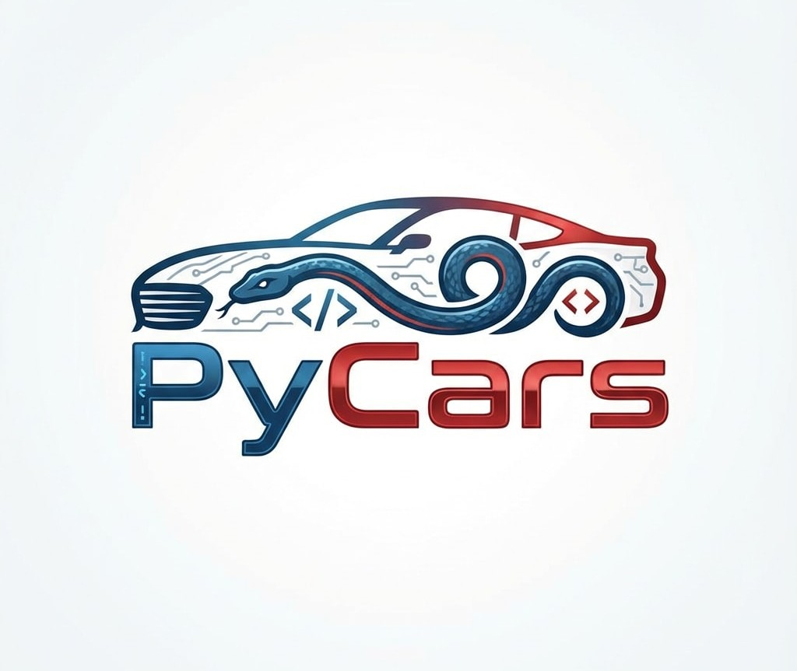

# PyCars - Car Sales Platform



**PyCars** is a full-stack web application built with **Python** and **Flask**, designed for publishing and searching car advertisements. This project simulates the core functionalities of major automotive marketplaces, featuring a robust backend, a responsive frontend, and a relational database.

---

## Key Features

### For Users (Buyers & Sellers)
* **Secure Authentication:** Complete Login and Registration system with password hashing.
* **User Dashboard:** Manage personal listings via the Profile page.
* **Create Listings:** Comprehensive form with validation, image uploads, and specs selection.
* **Advanced Search:** Filter by Make, Model, Price, Year, Mileage, and Fuel Type.
* **Smart Sorting:** Sort results by Price (Asc/Desc), Year, or Mileage.

### Technical Highlights
* **Relational Database:** SQLAlchemy schema linking `Users`, `Listings`, `Engines`, `Models`, and `Makes`.
* **Image Handling:** Secure upload and storage system in `static/uploads`.
* **Database Seeding:** Automated script (`populate_db.py`) to reset and populate the database with hundreds of car configurations and test listings.

---

## Tech Stack

* **Backend:** Python, Flask, SQLAlchemy.
* **Frontend:** HTML, CSS, JavaScript.
* **Database:** SQLite.
* **Security:** Werkzeug Security.

---

## Installation & Setup

Follow these steps to run the project locally:

### 1. Clone the Repository
``` bash
git clone https://github.com/ovidiu-costache/PyCars.git
cd PyCars
```

### 2. Create a Virtual Environment

It is recommended to use a virtual environment to manage dependencies.

``` bash
python -m venv .venv
source .venv/bin/activate
```

### 3. Install Dependencies

``` bash
pip install Flask flask_sqlalchemy flask_login
```

### 4. Database Setup

Run the population script to create tables and seed the database.

``` bash
python populate_db.py
```

Check if `instance` directory contains `pycars.db`.

### 5. Run the Application

``` bash
python app.py
```

The application will be accessible at `http://127.0.0.1:5000`.

---

## Test Account

To test admin functionalities or manage listings immediately, use the pre-configured account:

* **Account:** `admin@pycars.ro`
* **Password:** `admin123`

---

## The Team

Project developed by a team of Computer Science students at Faculty of Automatic Control and Computer Science.
* **Ovidiu-Ștefan Costache** - Project Lead, Software Architecture, Database Architecture & Git Management
* **Vlad Năstase** - Full Stack Implementation (Frontend UI/UX, Templates Design & Application Logic)
* **Ștefăniță Alexandru Stoica** - Backend Logic, Documentation, Manual Testing & Data Research

---

## License

This project was created for educational purposes.
